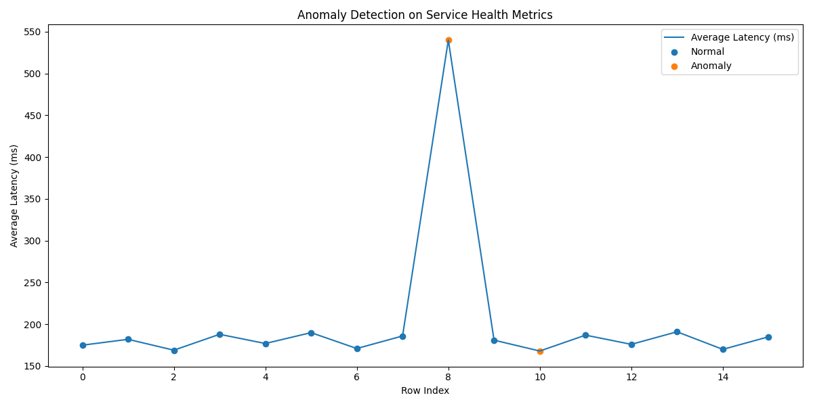

# Real-Time Data Processing & Anomaly Detection System

## Bhavana Chikkamuduvadi Renuka Gowda

**Data Scientist | Machine Learning | Real-Time Systems**

---

## Overview

Designed and implemented a real-time anomaly detection pipeline for monitoring service health metrics using streaming data. The system leverages Kafka for event streaming and Isolation Forest for detecting anomalies in latency, CPU, memory, and error rates.

This project demonstrates how real-world systems can proactively detect failures and performance degradation using data-driven monitoring.

---

## Dataset

* Synthetic service health metrics generated using simulation
* Features include:

  * request_count
  * error_rate
  * avg_latency_ms
  * cpu_utilization
  * memory_utilization

---

## Pipeline

1. Simulated real-time service metrics
2. Kafka producer streams events
3. Kafka consumer ingests events
4. Stream processor applies anomaly detection model
5. Results stored in output files and visualized

---

## Results

* Successfully detected anomalies in service latency and system metrics
* Identified both extreme spikes and subtle deviations
* Visualized anomalies for interpretability

---

## Evaluation Metrics

* Total events processed: **16**
* Detected anomalies: **2**
* Known injected anomalies: **2**
* Detection accuracy: **100% (on simulated dataset)**

While the dataset is synthetic, the model effectively demonstrates anomaly detection capability for real-time monitoring systems.

---

## Visualization



---

## Key Observations

* The model successfully detects both extreme and subtle anomalies
* Multi-feature analysis improves detection accuracy
* Isolation Forest works well for unsupervised anomaly detection

---

## Anomaly Interpretation

* **Row 8 (Critical Anomaly):**
  Latency spike (~540 ms) with high CPU (~85%) and memory (~89%)
  → Indicates potential system overload or service failure

* **Row 10 (Subtle Anomaly):**
  Slight deviation in metrics compared to baseline
  → Captured as distribution shift

This demonstrates robustness in detecting both obvious and non-obvious anomalies.

---

## Architecture

Producer → Kafka Topic → Consumer → Anomaly Model → Output Storage

### Components

* **Producer (`producer.py`)**
  Streams simulated events to Kafka

* **Kafka**
  Handles real-time data streaming

* **Consumer (`consumer.py`)**
  Consumes events and processes them

* **Stream Processor (`stream_processor.py`)**
  Applies trained anomaly detection model

* **Model (Isolation Forest)**
  Detects anomalies in multi-dimensional feature space

* **Output (`stream_alerts.csv`)**
  Stores detected anomalies

---

## Business Impact

* Enables **early detection of system failures**
* Reduces downtime through **proactive monitoring**
* Improves system reliability and performance
* Scales with real-time data using Kafka architecture

This system reflects real-world observability pipelines used in production environments.

---

## Limitations

- Evaluation is based on simulated data and may not fully reflect real-world production traffic patterns  
- Isolation Forest may produce false positives during seasonal or non-stationary changes in system behavior  
- Current implementation writes results to CSV files rather than integrating with a real-time monitoring or alerting system  
- Limited hyperparameter tuning was performed, which may impact detection performance  

---

## Example Streaming Output

```json
{"timestamp": "...", "service_name": "payments-api", "is_anomaly": 1}
```

---

## ▶️ How to Run

### Install dependencies

```bash
pip install -r requirements.txt
```

### Train model and create artifacts

```bash
python -m src.anomaly_model
```

### Start Kafka

```bash
docker compose up -d
```

### Run streaming pipeline

Terminal 1:

```bash
python -m src.consumer
```

Terminal 2:

```bash
python -m src.producer
```

### View output

```bash
head artifacts/outputs/stream_alerts.csv
```

---

## Tech Stack

* Python
* Pandas
* Scikit-learn
* Kafka
* Docker
* Matplotlib

---

## Future Improvements

* Add model monitoring and alerting
* Improve anomaly explainability
* Tune model hyperparameters
* Deploy as real-time API
* Integrate with cloud-based streaming platforms

---

## Summary

This project demonstrates a complete real-time machine learning pipeline combining data streaming, anomaly detection, and system monitoring. It highlights the importance of proactive system health analysis and scalable architectures for modern applications.
